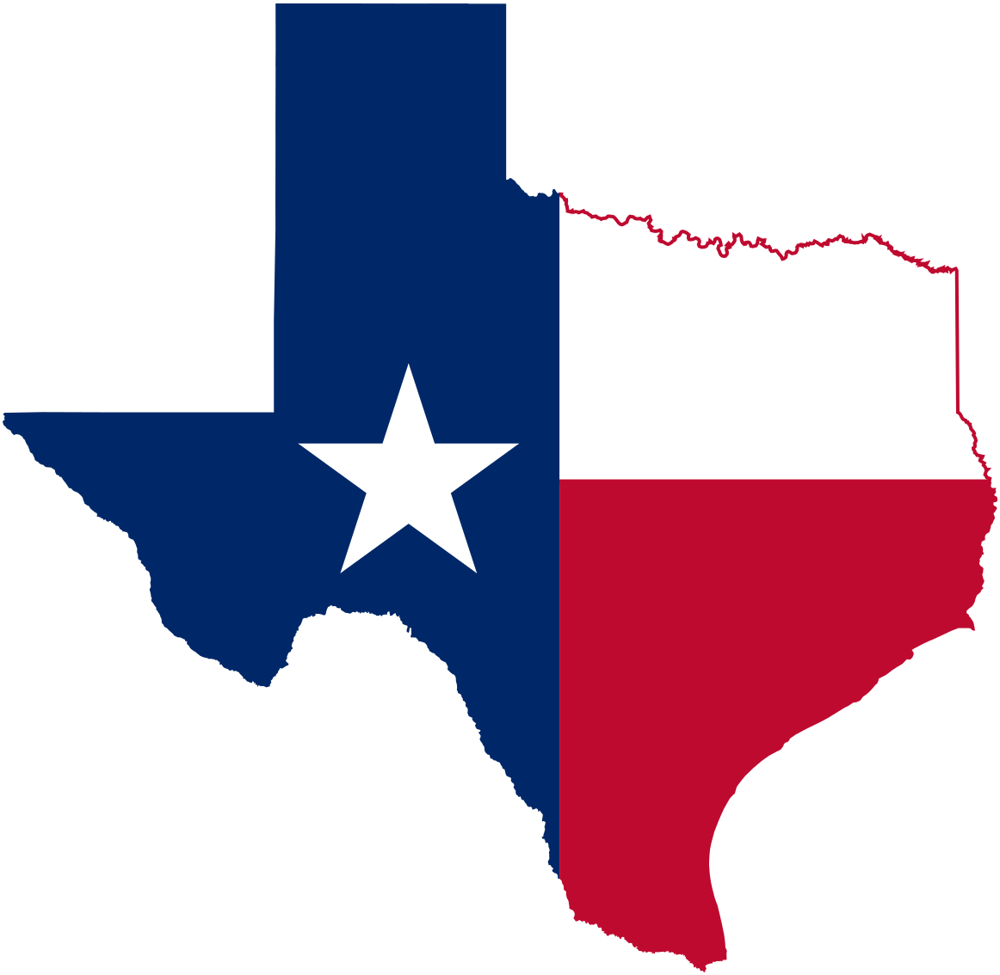

- [3 行まとめ](#3-行まとめ)
- [~~簡単に~~振り返る留学生活](#簡単に振り返る留学生活)
  - [授業](#授業)
  - [住まい](#住まい)
  - [食事](#食事)
  - [金](#金)
  - [進路](#進路)
- [まとめ](#まとめ)
- [謝辞](#謝辞)
- [参照](#参照)

## 3 行まとめ

1. University of Texas at Dallas(通称"UTD")で 8 月から勉強している
2. 金・就活・学業が辛い
3. 人生は”出逢い”や ❗

## ~~簡単に~~振り返る留学生活

### 授業

米国の大学院(University of Texas at Dallas)で Master Student として Computer Science を勉強しています。

今学期履修しているのは以下の 3 講義です。各学生は Track というものを選び(途中で変更可能)、それによって必修が変わります。

- Discrete Structures
  - 離散数学
  - Track に関わらず必修
- Advanced Computer Networks
  - ネットワーク
  - 自分の Track の必修
- System Security and Binary Analysis
  - バイナリ解析
  - 選択科目

"Discrete Structures"は学部レベルの講義なのでそこまで大変ではないです。やっている内容もそこまで高度でないので、教授の採点基準が厳しいという噂だけが不安です。"Advanced Computer Networks"も同じ教授で A が 2 割しか出ないのですよね。
"Discrete Structures"と"Advanced Computer Networks"はレポートと試験がそれぞれ 3 回あり、どちらもレポートと試験の初回が終わりました。前者は自分ではよくできたと思っているのですが、後者はかなりまずい感触でした(5 割行っているかな？)
だから、今後は先取りをして疑問を Office Hour で解消していこうと思っています。

この 3 つの中で一番面白いのはバイナリ解析に関する講義です。アセンブリを書いたり、バイナリを Disassemble して脆弱性を発見するという CTF のような講義です。授業内容・課題が面白いだけでなく教授との Office Hour も楽しみです。

Office Hour というのは教授と 1 対 1 で話せる時間です。毎回話に行くと、教授と仲が良くなり個人的な話もできるようになります。バイナリ解析の教授とは全然授業と関係のない話ばかりをしています。

教授との距離の近さは東大とは違った UTD の良い点だと思っています。

### 住まい

アメリカと言っても都市部の大学には日本人が何人かいるものだと思います。最悪中国人や韓国人がいると思うのですが、うちの大学はそこまで有名ではないからか Master には日本人はおろか中国人も韓国人もほぼいません。インド人が大半です。中国人は大体 Ph.D.の学生ですね。

インド人とは文化がかなり違うので、シェアハウスをした際にかなりカルチャーショックを受けました。UTD のインド人留学生はマンションの 1 室に 5〜6 人は住むのでプライベートな空間がなくかなりしんどかったです。最初はリビングで寝ていたのですが、夜中にイヤホンをせずアニメを観る人がいたり毎晩会話をする人がいたりして寝られずストレスがめちゃくちゃ溜まりました。その後、リビングはやめてベッドを共有して 3 人 1 部屋で寝ることになったのですが、いびきがひどくて夜中に目が覚めたり、冷房が効きすぎて目が覚めたりしていました。毎日日本の友達に愚痴っていました。

今は一人暮らしをしているのですが、逆に刺激が少なくて物足りないです。香辛料の匂いを気にしていた日々が懐かしくもあります。「自分は天の邪鬼だな」と思っています。できれば次の学期はシェアハウスをして家賃を抑えたいと思っています。今回の反省を活かして寝室は分けるつもりです。そうすれば程よい刺激が得られつつ、プライベートもある程度確保できると予想しています。

### 食事

ご飯というかお金なのですが、学費と家賃が高すぎて(前述の通り、大学内で一人暮らしをすることにしてしまったのもあり)金欠による栄養失調が続いています。金欠が続くとカロリー/値段で考えるようになり、その結果辛ラーメンばかりを食べていますが、全然足りないですね。
今日の朝、風呂場で裸の自分を見るとくびれができていて笑ってしまいました。仲の良い教授にも心配されてしまっています。

対策として自炊をするようになりました。自炊なら安くてもある程度カロリーが取れます。車がないと特定のスーパーにしか行けない＆スーパーに行っても買える量が限定されるので、Walmart Plus を利用して材料は買っています。月額いくらか払えば、Walmart から食品などを配送してくれるサービスです。

米国で自炊系 Youtuber を目指そうと奮闘していますが、先に餓死しそうです。

<iframe width="560" height="315" src="https://www.youtube.com/embed/oAKs6ghpaMI" title="YouTube video player" frameborder="0" allow="accelerometer; autoplay; clipboard-write; encrypted-media; gyroscope; picture-in-picture" allowfullscreen></iframe>

### 金

現在とある研究室で RA として働いています。アメリカでは Master の場合は留学してすぐにサマーインターンに応募することになるため、並行して応募を進めています。

### 進路

米国のソフトウェアエンジニア市場は近年冷え込んでおり、採用を絞っている企業も多いです。進路については、セキュリティの授業の先生の研究テーマが面白そうなこと、Ph.D. Program の支援制度、将来の VISA の選択肢などを踏まえ、Master 卒業後に米国の大学院で Ph.D. に進む可能性も含めて検討しています。

とりあえず今はどちらも選べるように、学業と研究室での成果を出しつつ、LeetCode を日々継続しています。就活・学業・研究の優先度をつけながら自分を管理するのはなかなか大変です。

## まとめ

大変なところはありますが、日本にいたら経験できないようなこと・出会えなかった人ばかりで総合的に満足しています。初めの 1 ヶ月でうまく行かなかった部分は挽回できるように頑張りたいです。

## 謝辞

UTD の教授・友人、学費・生活費をくれる親、日本の知り合いに感謝

## 参照

- <https://en.wikipedia.org/wiki/Texas>
