## ヒープとは

ヒープ（heap）は完全二分木の形をしたデータ構造で、「親は常に子以下（or 以上）」という局所的な大小関係だけを保証する。

- min-heap: 親 $\leq$ 子。根が常に最小
- max-heap: 親 $\geq$ 子。根が常に最大

「ヒープ ≠ ソート済み」であることに注意。保証されるのは親子間の関係だけで、兄弟間の順序は不定。

### 完全二分木と配列表現

ヒープは完全二分木（最下段以外はすべて埋まり、最下段は左詰め）なので、ポインタなしで配列に載せられる。0始まりのインデックス`k`に対して:

- 左の子: `2*k + 1`
- 右の子: `2*k + 2`
- 親: `(k - 1) // 2`

min-heapの例（配列: `[1, 2, 3, 5, 4, 7]`）

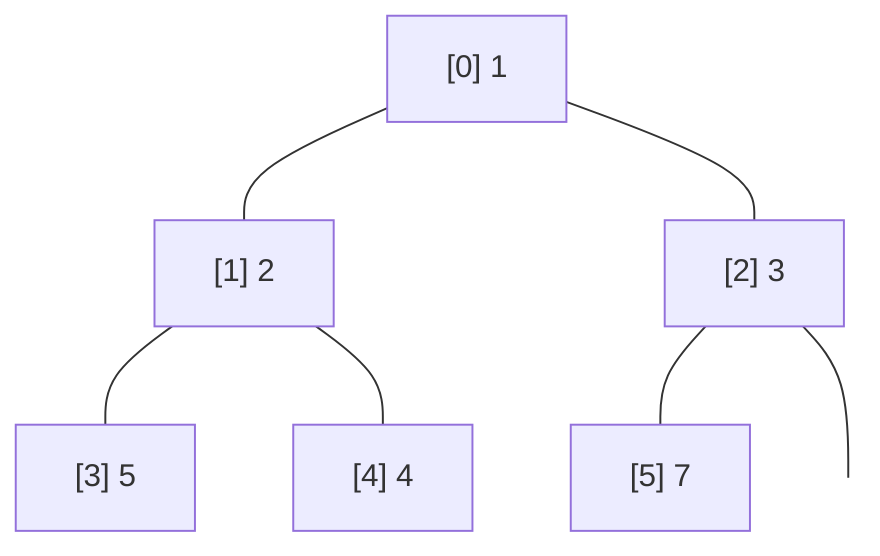

- `heap[1]=2` の子は `heap[3]=5`, `heap[4]=4` → $2 \leq 5$, $2 \leq 4$ ✓
- `heap[2]=3` の子は `heap[5]=7` → $3 \leq 7$ ✓
- 兄弟の 5 と 4、従兄弟の 4 と 7 の間に順序の保証はない

### 計算量

| 操作 | 計算量 | 理由 |
|------|--------|------|
| peek（最小/最大の参照） | $O(1)$ | `heap[0]`を見るだけ |
| push | $O(\log n)$ | 末尾に追加して根方向へ上がる（木の高さ分） |
| pop | $O(\log n)$ | 根を取り出し、末尾要素を根に置いて葉方向へ下げる |
| heapify（配列→ヒープ） | $O(n)$ | ボトムアップ構築 |
| 任意要素の検索 | $O(n)$ | 順序の保証が局所的なので線形探索するしかない |

「最小（最大）を高速に出し入れする」のがヒープの存在意義であり、全体のソートや任意要素の検索には向かない。

### push（要素の追加）

新しい要素を末尾に追加し、親と比較しながら上に移動（bubble up）する。親より小さければ入れ替え、親以上になるか根に達したら停止。

例: `[1, 2, 3, 5, 4, 7]`に`0`をpush

step 1. 末尾に追加 → `[1, 2, 3, 5, 4, 7, 0]`

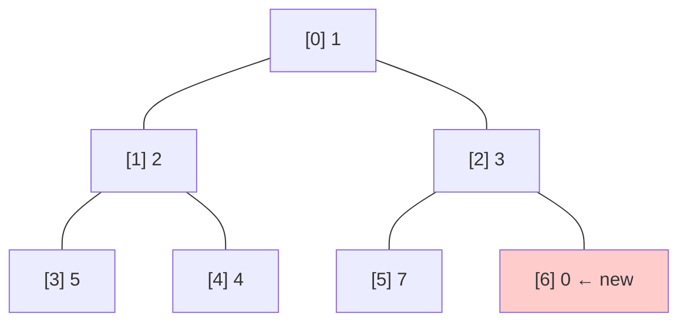

step 2. `0 < 3`（親）なので入れ替え → `[1, 2, 0, 5, 4, 7, 3]`

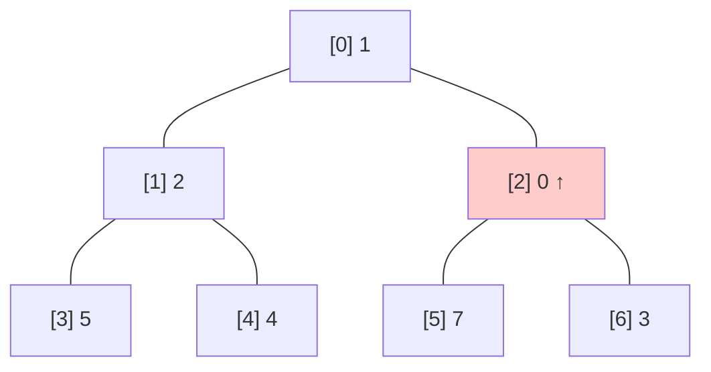

step 3. `0 < 1`（親）なので入れ替え → `[0, 2, 1, 5, 4, 7, 3]`。根に到達、終了。

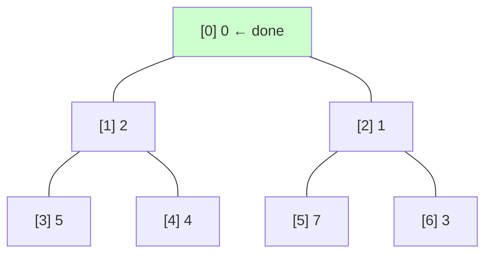

木の高さは $\lfloor \log_2 n \rfloor$ なので、最大でもその回数しか入れ替えが起きない → $O(\log n)$。

### pop（最小要素の取り出し）

根（最小）を取り出し、末尾要素を根に置いてから子と比較しながら下に移動（bubble down）する。子のうち小さい方と入れ替え、子以下になるか葉に達したら停止。

例: `[1, 2, 3, 5, 4, 7]`からpop

step 1. 根`1`を取り出し、末尾`7`を根に → `[7, 2, 3, 5, 4]`

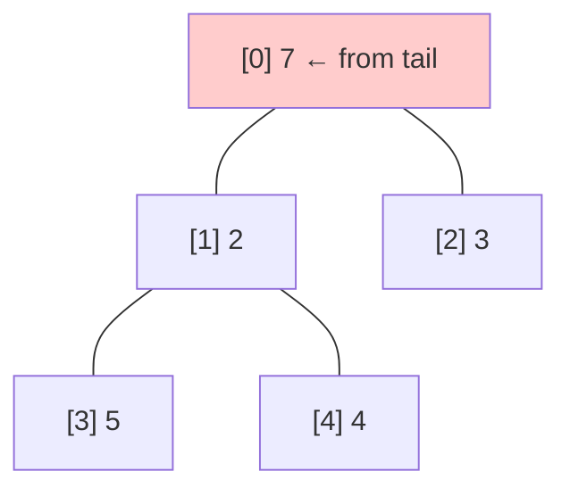

step 2. 子は`2`と`3`。小さい方`2`と比較 → `7 > 2`なので入れ替え → `[2, 7, 3, 5, 4]`

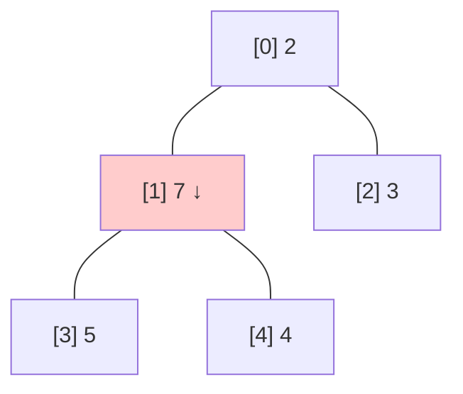

step 3. 子は`5`と`4`。小さい方`4`と比較 → `7 > 4`なので入れ替え → `[2, 4, 3, 5, 7]`

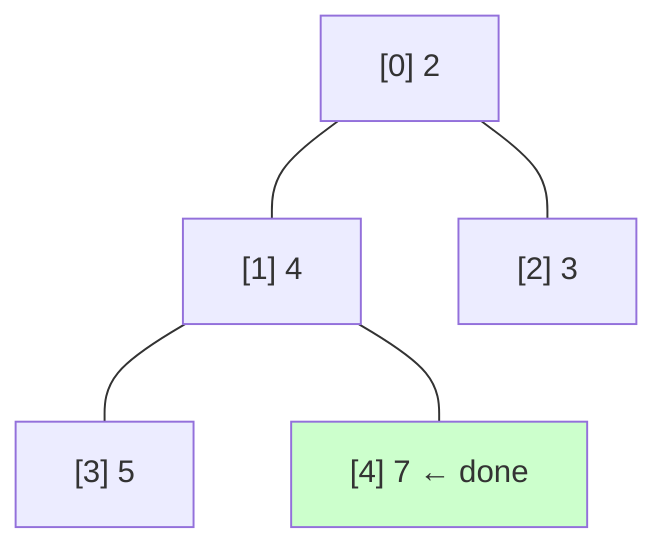

葉に到達、終了。返り値は`1`。pushと同様 $O(\log n)$。

### heapify（配列のヒープ化）

任意の配列をヒープに変換する。「葉は既にヒープ条件を満たしている」ことを利用して、最後の非葉ノードから根に向かって順にbubble downを適用する。

例: `[5, 1, 3, 2, 4]`をheapify

初期状態（ヒープ条件を満たしていない）:

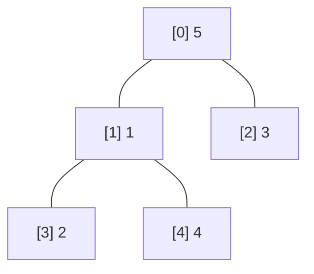

最後の非葉ノードは `index = n//2 - 1 = 5//2 - 1 = 1`。ここから根（index 0）に向かって順にbubble downを適用する。葉ノード（index 2, 3, 4）は子を持たないので処理不要。

step 1. index 1を処理: `heap[1]=1`の子は `heap[3]=2` と `heap[4]=4`。$1 \leq 2$ かつ $1 \leq 4$ なので既にヒープ条件を満たしている → 変更なし

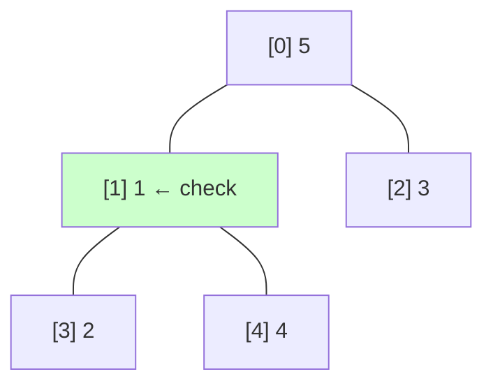

step 2. index 0を処理: `heap[0]=5`の子は `heap[1]=1` と `heap[2]=3`。小さい方の子 `1` と比較 → $5 > 1$ なので入れ替え → `[1, 5, 3, 2, 4]`

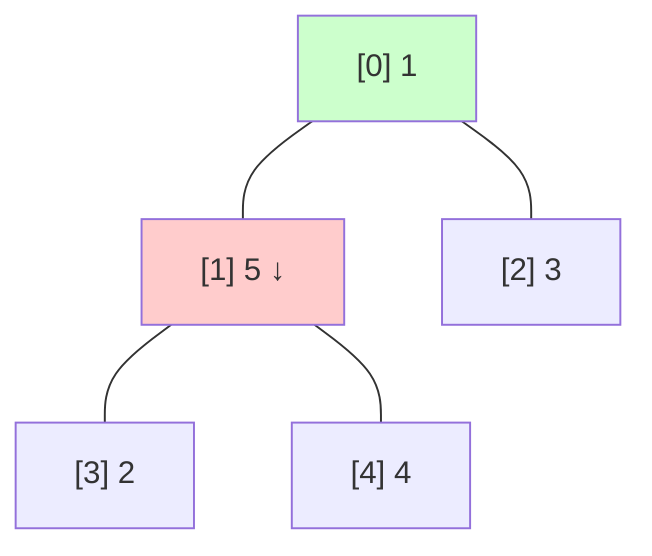

step 3. bubble downの続き: `heap[1]=5`の子は `heap[3]=2` と `heap[4]=4`。小さい方の子 `2` と比較 → $5 > 2$ なので入れ替え → `[1, 2, 3, 5, 4]`。`heap[3]=5`は葉なので終了

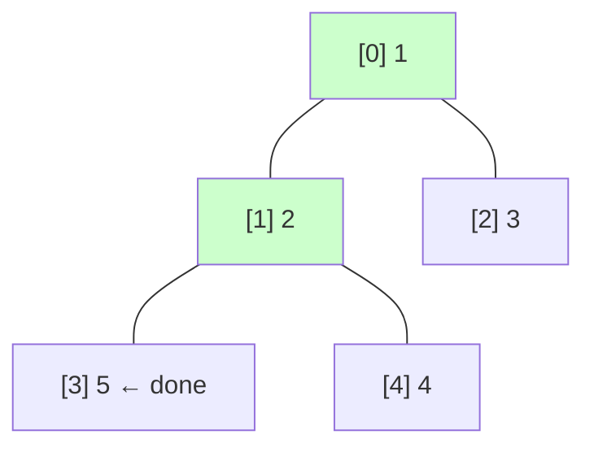

なぜ $O(n)$ か: 葉（約 $n/2$ 個）は処理不要、その1つ上の層（約 $n/4$ 個）は高さ1、さらに上（約 $n/8$ 個）は高さ2...と、処理量の合計は $\sum_{h=0}^{\lfloor \log n \rfloor} \frac{n}{2^{h+1}} \cdot h \approx n$ になる。1つずつ`push`する方式（$O(n \log n)$）より効率的。

## TL;DR

- `heapq`は「最小値（優先度が最小）」を高速に取り出せる最小ヒープ(min-heap)を、普通の`list`上で扱う標準ライブラリ
- `heapify`は$O(n)$、`heappush/heappop`は基本$O(\log n)$
- Python 3.14から`heapify_max/heappush_max/heappop_max`などmax-heap APIが追加された（それ以前は負数化などで疑似max-heapが定番）

## heapqとは

`heapq`は「ヒープキュー（優先度付きキュー）」の実装。ヒープは親が子以下になる二分木（min-heap）で、配列（Pythonの`list`）で表す。具体的には、0始まりの配列`heap`に対して

- `heap[k] <= heap[2*k+1]`
- `heap[k] <= heap[2*k+2]`

が成り立つように並べる（存在しない子は無視）。このとき最小要素は必ず`heap[0]`に来る。

重要なのは「ヒープ = ソート済み」ではないこと。保証されるのは親子の局所的な大小関係だけで、全体として昇順になっているわけではない。

```python
import heapq

a = [5, 1, 3, 2, 4]
heapq.heapify(a)
print(a)       # 例えば [1, 2, 3, 5, 4] のようになる
print(a[0])    # 1（最小は先頭）
```

また、`list.sort()`と同様に比較は`<`のみを使う（= key抽出の仕組みは基本持たない）ので、優先度付きにしたい場合は`(priority, item)`のようなタプルでdecorateするのが定番。

## 提供される主なAPI

min-heap（通常の`heapq`）の主要関数は以下。

- `heapify(x)`: リストをin-placeでヒープ化（線形時間）
- `heappush(heap, item)`: push（ヒープ条件維持、$O(\log n)$）
- `heappop(heap)`: 最小をpop（空なら`IndexError`、$O(\log n)$）
- `heappushpop(heap, item)`: pushしてすぐpop（別々に呼ぶより効率的）
- `heapreplace(heap, item)`: 最小をpopして`item`をpush（サイズ固定向け）
- `merge(*iterables, key=None, reverse=False)`: ソート済み列のマージ（ジェネレータ）
- `nsmallest / nlargest`: 上位n件を抜き出す

### max-heap API（Python 3.14+）

Python 3.14から、max-heap向けに`*_max`系が公開APIとして追加された。

- `heapify_max(x)`
- `heappush_max(heap, item)`
- `heappop_max(heap)`
- `heappushpop_max(heap, item)`
- `heapreplace_max(heap, item)`

それ以前のバージョンでは「値を負にする」「`(-priority, item)`にする」などで疑似max-heapにすることが多い。

## 実装の雰囲気（標準ライブラリ）

実装の核は「末尾に追加して親方向へ上げる（siftdown）」と「根に持ってきた要素を子方向へ下げる（siftup）」の2つ。`heappush/heappop`はそれを呼んでいるだけ。

<details>
<summary>heappush / heappop / heapify（標準ライブラリのpure Python実装例）</summary>

```python
def heappush(heap, item):
    heap.append(item)
    _siftdown(heap, 0, len(heap)-1)

def heappop(heap):
    lastelt = heap.pop()            # 空ならIndexError
    if heap:
        returnitem = heap[0]
        heap[0] = lastelt
        _siftup(heap, 0)
        return returnitem
    return lastelt

def heapify(x):
    n = len(x)
    for i in reversed(range(n//2)):
        _siftup(x, i)

def _siftdown(heap, startpos, pos):
    newitem = heap[pos]
    while pos > startpos:
        parentpos = (pos - 1) >> 1
        parent = heap[parentpos]
        if newitem < parent:
            heap[pos] = parent
            pos = parentpos
            continue
        break
    heap[pos] = newitem

def _siftup(heap, pos):
    endpos = len(heap)
    startpos = pos
    newitem = heap[pos]
    childpos = 2*pos + 1
    while childpos < endpos:
        rightpos = childpos + 1
        if rightpos < endpos and not heap[childpos] < heap[rightpos]:
            childpos = rightpos
        heap[pos] = heap[childpos]
        pos = childpos
        childpos = 2*pos + 1
    heap[pos] = newitem
    _siftdown(heap, startpos, pos)
```

</details>

この「上下に動かして局所条件を回復する」から、push/popは木の高さぶん（およそ$\log n$）だけ動き、理論的に$O(\log n)$になる。

## 使い方の基本

### 1) 最小を取り出す（優先度付きキューの最小版）

```python
import heapq

h = []
heapq.heappush(h, 5)
heapq.heappush(h, 1)
heapq.heappush(h, 3)

print(h[0])               # 1（peekはheap[0]）
print(heapq.heappop(h))   # 1
print(heapq.heappop(h))   # 3
print(heapq.heappop(h))   # 5
```

### 2) 既存リストをヒープ化してから使う

```python
import heapq

a = [5, 1, 3, 2, 4]
heapq.heapify(a)          # in-place
print([heapq.heappop(a) for _ in range(len(a))])
# popし続けると昇順で出てくる
```

これはヒープソートだが、`sorted()`と違ってステーブルではない（同値の相対順が保持されない）。

## コーナーケース / ハマりどころ

### 空ヒープに対するpop

`heappop([])`は`IndexError`。

```python
import heapq
h = []
# heapq.heappop(h)  # IndexError
```

### 比較できない要素を混ぜると落ちる

`heapq`は比較に`<`しか使わないので、要素同士が比較不能だと`TypeError`になりがち。
典型は「優先度が同じときに第2要素（task本体）の比較に行ってしまう」パターン。

## 具体例1: ストリームからTop-K（固定サイズヒープ）

「巨大なデータから上位K件だけ欲しい」は、サイズKのヒープを維持するとメモリO(K)で済む。

```python
import heapq

def topk_largest(iterable, k):
    it = iter(iterable)
    h = []
    for _ in range(k):
        try:
            heapq.heappush(h, next(it))
        except StopIteration:
            return sorted(h, reverse=True)

    # h[0] が「今のTop-Kの中で最小」
    for x in it:
        if x > h[0]:
            heapq.heapreplace(h, x)   # pop+pushを1回で
    return sorted(h, reverse=True)
```

`heapreplace`は「必ずpopしてからpush」なのでサイズ固定に向く。一方、`heappushpop`は「小さい方を返して大きい方を残す」挙動なので、条件次第で使い分ける（差はドキュメントに記載がある）。

## 具体例2: 優先度キュー（同点処理・削除・更新）

優先度付きキューを実戦投入すると、次の問題が出る。

- 同じ優先度の順序（安定性）をどうする？
- `(priority, task)`で、`task`が比較不能だと壊れる
- 既存タスクの優先度変更や削除をどう扱う？

ドキュメント推奨の定番は`[priority, counter, task]`で、`counter`を同点決勝の一意IDにし、削除は「墓石（REMOVED）で無効化」して遅延除去する方式。

```python
import heapq
import itertools

pq = []
entry_finder = {}
REMOVED = "<removed>"
counter = itertools.count()

def add_task(task, priority=0):
    if task in entry_finder:
        remove_task(task)
    count = next(counter)
    entry = [priority, count, task]
    entry_finder[task] = entry
    heapq.heappush(pq, entry)

def remove_task(task):
    entry = entry_finder.pop(task)
    entry[-1] = REMOVED

def pop_task():
    while pq:
        priority, count, task = heapq.heappop(pq)
        if task is not REMOVED:
            del entry_finder[task]
            return task
    raise KeyError("pop from an empty priority queue")
```

## 具体例3: ソート済みの複数ストリームをマージ（heapq.merge）

`heapq.merge(*iterables, key=None, reverse=False)`は、入力がすでにソート済みであることを前提に、全体をメモリに載せずにマージ結果を返す（ジェネレータ）。

```python
import heapq

a = [1, 4, 7]
b = [2, 3, 10]
c = [0, 5, 6]

print(list(heapq.merge(a, b, c)))
# [0, 1, 2, 3, 4, 5, 6, 7, 10]
```

## 具体例4: ランニング中央値（2ヒープ）

中央値をオンラインに更新したいときは「小さい側をmax-heap」「大きい側をmin-heap」に分けてバランスするのが定番。Python 3.14のドキュメントにも例が載っている（`heappush_max`等を使う版）。

（3.14未満ならmax-heap側を負数化で持つのが一般的。）


## CPythonの実装

### 全体構成: PythonフォールバックとC実装

`heapq`モジュールは二層構造になっている。`Lib/heapq.py`にpure Python実装があり、末尾で

```python
try:
    from _heapq import *
except ImportError:
    pass
```

としてC実装（`Modules/_heapqmodule.c`）で上書きする。つまり通常のCPythonではC実装が使われ、Python実装はフォールバック兼リファレンスという位置付け。以下ではPython実装を読みながら、アルゴリズムの本質を追う。

### siftの命名について

siftは英語で「ふるいにかける」という意味。砂をふるいにかけて粒の大きさで分けるイメージ。

CPythonの命名は直感と逆なので注意:

- `_siftdown`: 対象要素は上に移動する。名前は「親が下にふるい落とされる(sift down)」という視点
- `_siftup`: 対象要素は下に移動する。名前は「子が上にふるい上げられる(sift up)」という視点

関数名は「操作対象」ではなく「押しのけられる周囲の要素」の動きを表している。

### `_siftdown`: 親を下にふるい落として、要素を根方向へ上げる

`heappush`の核。指定位置の要素を根方向へ上げる。

```python
def _siftdown(heap, startpos, pos):
    # heap[pos]の要素を、startposの位置まで遡って正しい位置に収める
    newitem = heap[pos]             # 移動対象を退避（最後に1回だけ書き込む）
    while pos > startpos:           # 上限(startpos)に達するまでループ
        parentpos = (pos - 1) >> 1  # 親のインデックス（(pos-1)//2 と同じ）
        parent = heap[parentpos]    # 親の値を取得
        if newitem < parent:        # 退避した値が親より小さければ
            heap[pos] = parent      #   親を子の位置にコピー（親がsift downする）
            pos = parentpos         #   注目位置を1つ上へ
            continue
        break                       # 親以上ならここが正しい位置
    heap[pos] = newitem             # 確定した位置に1回だけ書き込み
```

素朴なswap方式だとループ1回につき代入3回（`tmp=a; a=b; b=tmp`）だが、この方式は「親を下ろす」代入1回 + 最後の書き込み1回で済む。

例: `[1, 2, 3, 5, 4, 7]`に`0`をpush → append後`[1, 2, 3, 5, 4, 7, 0]`、`_siftdown(heap, 0, 6)`が呼ばれる

初期状態:

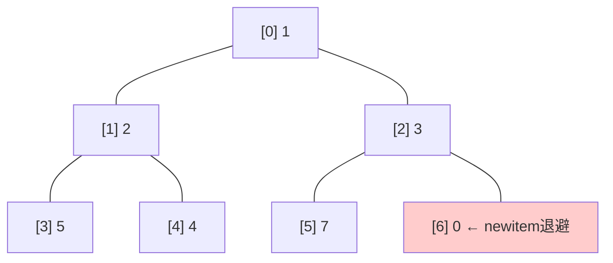

実行トレース:

```
newitem = 0, pos = 6

pos=6: 親 heap[2]=3。0 < 3 → heap[6]=3 に上書き、pos=2 へ
pos=2: 親 heap[0]=1。0 < 1 → heap[2]=1 に上書き、pos=0 へ
pos=0: startpos=0 に到達 → ループ終了
heap[0] = 0 を書き込み
```

完了後:

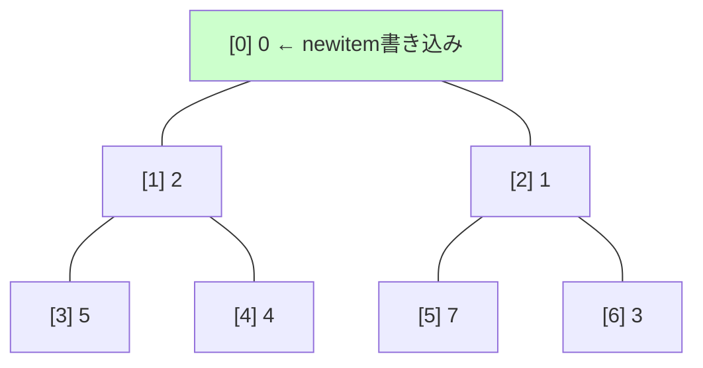

親の`1`と`3`がそれぞれ1段ずつ下にずれ（sift down）、空いた根の位置に`newitem=0`が収まった。

### `_siftup`: 子を上にふるい上げて、要素を葉方向へ下げる — Knuthの最適化

`heappop`の核。指定位置の要素を葉方向へ下げる。2つのフェーズに分かれている。

```python
def _siftup(heap, pos):
    endpos = len(heap)              # ヒープの長さ（子がこれ以上なら存在しない）
    startpos = pos                  # 開始位置を記憶（フェーズ2の上限に使う）
    newitem = heap[pos]             # 移動対象を退避
    # === フェーズ1: newitemを無視して、小さい子を葉まで引き上げる ===
    childpos = 2*pos + 1            # 左の子のインデックス
    while childpos < endpos:        # 子が存在する間
        rightpos = childpos + 1     # 右の子のインデックス
        if rightpos < endpos and not heap[childpos] < heap[rightpos]:
            childpos = rightpos     # 左右で小さい方を選ぶ
        heap[pos] = heap[childpos]  # 小さい子を親の位置に引き上げ（子がsift upする）
        pos = childpos              # 注目位置をその子に移動
        childpos = 2*pos + 1        # 次の左の子
    # === フェーズ2: 葉にnewitemを仮置きし、正しい位置まで上に戻す ===
    heap[pos] = newitem             # 葉にnewitemを仮置き
    _siftdown(heap, startpos, pos)  # startposまでの範囲で上方向に調整
```

- フェーズ1: `newitem`との比較を一切せず、小さい子を無条件に引き上げながら葉まで突き進む。ループ1回の比較は「左右の子の比較」の1回だけ
- フェーズ2: 葉に仮置きした`newitem`を`_siftdown`で正しい位置まで戻す

教科書方式だとループ1回につき「子同士の比較」+「newitemと子の比較」= 2回の比較が必要だが、CPython方式はフェーズ1で1回だけ。`heappop`で根に来るのは末尾の要素（大きい傾向）なのでどうせ葉近くまで落ちる → 途中で比較しても無駄になることが多い（Knuth, Volume 3）。

例: `[1, 3, 2, 5, 4, 7, 6]`からpop → 根`1`を返し、末尾`6`を根に置く → `_siftup(heap, 0)`が呼ばれる

初期状態（`6`を根に仮置き）:

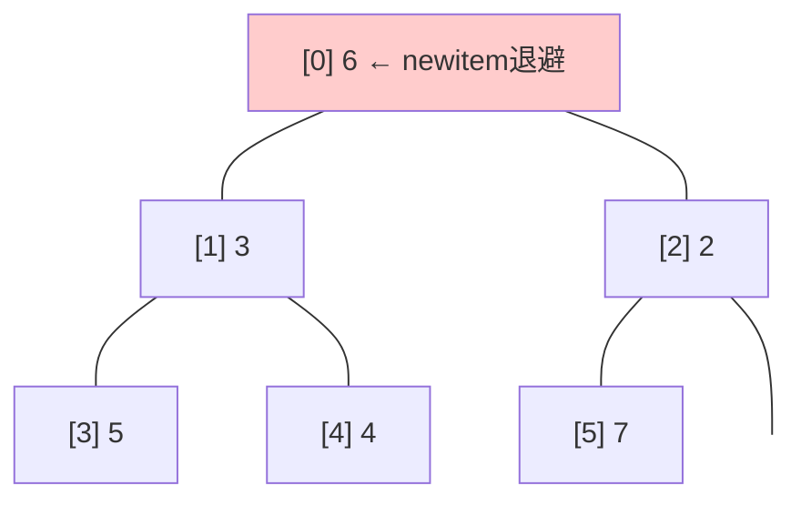

フェーズ1実行トレース:

```
newitem = 6, pos = 0

pos=0: 子は heap[1]=3, heap[2]=2。小さい方 2 を引き上げ → heap[0]=2, pos=2
pos=2: 子は heap[5]=7 のみ。引き上げ → heap[2]=7, pos=5
pos=5: 子なし（葉）→ ループ終了
heap[5] = newitem = 6 を仮置き
```

フェーズ1完了後: `[2, 3, 7, 5, 4, 6]`

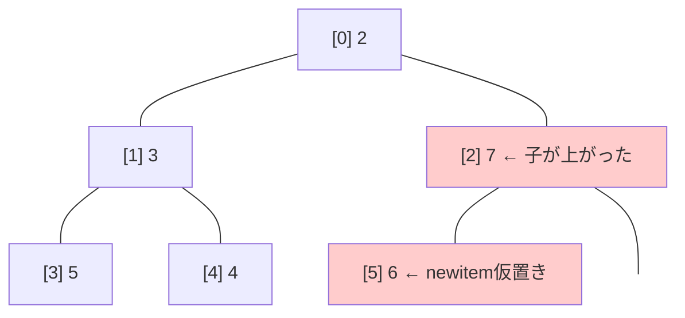

7がindex 2に上がっているが、$7 > 6$ なのでヒープ条件を満たしていない。フェーズ1は正しさを気にせず葉まで突き進むため、こうした一時的な不整合が生じる。

フェーズ2: `_siftdown(heap, 0, 5)`で`6`を正しい位置へ

```
pos=5: 親 heap[2]=7。6 < 7 → heap[5]=7, pos=2
pos=2: 親 heap[0]=2。6 < 2? No → ループ終了
heap[2] = 6 を書き込み
```

完了後: `[2, 3, 6, 5, 4, 7]`

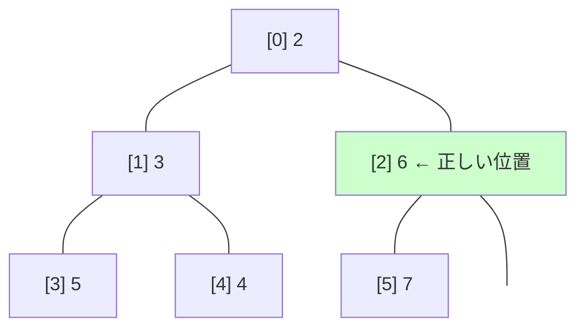

フェーズ1で誤って上がった`7`が、フェーズ2で`6`と入れ替わって正しい位置に戻った。フェーズ2の`_siftdown`は1段上がるだけで済んでおり、フルに比較するより効率的。

ソースコメントのベンチマーク（n=1000のランダム配列）:

| 操作 | 教科書方式 | CPython方式 |
|------|-----------|------------|
| heapify | ~1,850 | ~1,660 |
| 1000回heappop | ~15,000 | ~8,690 |

### `heapify`: ボトムアップ構築がO(n)になる理由

```python
def heapify(x):
    n = len(x)
    for i in reversed(range(n//2)):
        _siftup(x, i)
```

`n//2`から0まで逆順に`_siftup`を呼ぶ。これがO(n)になる直感:

- 葉（全体の約半分）は処理不要
- 葉の1つ上の層（約n/4個）は高さ1しか下がらない
- 根に近いほど深く下がるが、その層のノード数は少ない
- 合計: `n/4 * 1 + n/8 * 2 + n/16 * 3 + ... ≈ n`（等比×等差級数の和）

一方「1個ずつ`heappush`する」方式はO(n log n)。ソースコメントにも「heapify() is more efficient, when you can use it」とある。

### `heappushpop`と`heapreplace`: なぜ分けているか

```python
def heappushpop(heap, item):
    if heap and heap[0] < item:
        item, heap[0] = heap[0], item
        _siftup(heap, 0)
    return item

def heapreplace(heap, item):
    returnitem = heap[0]
    heap[0] = item
    _siftup(heap, 0)
    return returnitem
```

- `heappushpop`: 「pushしてからpop」と等価。`item`が現在の最小以下なら、push直後にそのまま返ってくるので`_siftup`すら不要（短絡）。`nlargest`で使われる
- `heapreplace`: 「popしてからpush」と等価。先にpopするので、返る値が`item`より大きい場合がある。`nsmallest`やサイズ固定ヒープで使われる

どちらも「push + popを別々に呼ぶ」より`_siftup`が1回で済むため効率的。

### `nsmallest`/`nlargest`: 3つの戦略

```python
def nsmallest(n, iterable, key=None):
    if n == 1:
        return [min(iterable, key=key)]     # 戦略1: min()

    try:
        size = len(iterable)
    except (TypeError, AttributeError):
        pass
    else:
        if n >= size:
            return sorted(iterable, key=key)[:n]  # 戦略2: sorted()

    # 戦略3: サイズnのmax-heapを使う
    ...
```

- $n = 1$: `min()`で十分（1パス、$O(n)$）
- $n \geq \text{size}$: 全部必要なので`sorted()`のほうが効率的（Timsortは実データに強い）
- それ以外: サイズ$n$のmax-heapを維持し、現在のTop-nより小さい値が来たら入れ替え。メモリ$O(n)$で、巨大なイテラブルに対応できる

`nsmallest`でmax-heapを使うのは「Top-nの中で最大のもの」と新要素を比較して、新要素が小さければ差し替えるため。

### `merge`: ジェネレータによるk-wayマージ

```python
def merge(*iterables, key=None, reverse=False):
    h = []
    for order, it in enumerate(map(iter, iterables)):
        try:
            next = it.__next__
            h.append([next(), order * direction, next])
        except StopIteration:
            pass
    _heapify(h)
    while len(h) > 1:
        try:
            while True:
                value, order, next = s = h[0]
                yield value
                s[0] = next()
                _heapreplace(h, s)
        except StopIteration:
            _heappop(h)
    ...
```

設計のポイント:

- ヒープの要素は`[現在値, 順序, next関数]`のリスト（タプルではなくリスト）。`s[0] = next()`でin-place更新し、`_heapreplace`に再利用できる
- `order`は入力の順番で、同値のとき安定ソートを実現する（`direction`は`reverse`時に符号反転）
- イテレータが枯渇すると`StopIteration`を投げるので、それをキャッチして`_heappop`で除去
- 残り1本になったら`yield from`で直接流す（ヒープ操作のオーバーヘッドを回避）
- 全データをメモリに載せない。各イテレータから1要素ずつしか保持しないため、巨大なソート済みファイルのマージなどに適する

### C実装（`_heapqmodule.c`）との違い

C実装はアルゴリズムとしてはPython版と同一だが、以下の点で高速:

- 関数呼び出しのオーバーヘッドがない（`_siftup`/`_siftdown`がCのstaticで直接呼ばれる）
- Python objectの参照カウント管理を直接操作
- `merge`と`nsmallest`/`nlargest`はPython実装のまま（C化されていない）

<details>
<summary><a href="https://github.com/python/cpython/blob/3.14/Lib/heapq.py">Lib/heapq.py</a> 全文</summary>

````python
"""Heap queue algorithm (a.k.a. priority queue).

Heaps are arrays for which a[k] <= a[2*k+1] and a[k] <= a[2*k+2] for
all k, counting elements from 0.  For the sake of comparison,
non-existing elements are considered to be infinite.  The interesting
property of a heap is that a[0] is always its smallest element.

Usage:

heap = []            # creates an empty heap
heappush(heap, item) # pushes a new item on the heap
item = heappop(heap) # pops the smallest item from the heap
item = heap[0]       # smallest item on the heap without popping it
heapify(x)           # transforms list into a heap, in-place, in linear time
item = heappushpop(heap, item) # pushes a new item and then returns
                               # the smallest item; the heap size is unchanged
item = heapreplace(heap, item) # pops and returns smallest item, and adds
                               # new item; the heap size is unchanged

Our API differs from textbook heap algorithms as follows:

- We use 0-based indexing.  This makes the relationship between the
  index for a node and the indexes for its children slightly less
  obvious, but is more suitable since Python uses 0-based indexing.

- Our heappop() method returns the smallest item, not the largest.

These two make it possible to view the heap as a regular Python list
without surprises: heap[0] is the smallest item, and heap.sort()
maintains the heap invariant!
"""

# Original code by Kevin O'Connor, augmented by Tim Peters and Raymond Hettinger

__about__ = """Heap queues

[explanation by François Pinard]

Heaps are arrays for which a[k] <= a[2*k+1] and a[k] <= a[2*k+2] for
all k, counting elements from 0.  For the sake of comparison,
non-existing elements are considered to be infinite.  The interesting
property of a heap is that a[0] is always its smallest element.

The strange invariant above is meant to be an efficient memory
representation for a tournament.  The numbers below are 'k', not a[k]:

                                   0

                  1                                 2

          3               4                5               6

      7       8       9       10      11      12      13      14

    15 16   17 18   19 20   21 22   23 24   25 26   27 28   29 30


In the tree above, each cell 'k' is topping '2*k+1' and '2*k+2'.  In
a usual binary tournament we see in sports, each cell is the winner
over the two cells it tops, and we can trace the winner down the tree
to see all opponents s/he had.  However, in many computer applications
of such tournaments, we do not need to trace the history of a winner.
To be more memory efficient, when a winner is promoted, we try to
replace it by something else at a lower level, and the rule becomes
that a cell and the two cells it tops contain three different items,
but the top cell "wins" over the two topped cells.

If this heap invariant is protected at all time, index 0 is clearly
the overall winner.  The simplest algorithmic way to remove it and
find the "next" winner is to move some loser (let's say cell 30 in the
diagram above) into the 0 position, and then percolate this new 0 down
the tree, exchanging values, until the invariant is re-established.
This is clearly logarithmic on the total number of items in the tree.
By iterating over all items, you get an O(n ln n) sort.

A nice feature of this sort is that you can efficiently insert new
items while the sort is going on, provided that the inserted items are
not "better" than the last 0'th element you extracted.  This is
especially useful in simulation contexts, where the tree holds all
incoming events, and the "win" condition means the smallest scheduled
time.  When an event schedules other events for execution, they are
scheduled into the future, so they can easily go into the heap.  So, a
heap is a good structure for implementing schedulers (this is what I
used for my MIDI sequencer :-).

Various structures for implementing schedulers have been extensively
studied, and heaps are good for this, as they are reasonably speedy,
the speed is almost constant, and the worst case is not much different
than the average case.  However, there are other representations which
are more efficient overall, yet the worst cases might be terrible.

Heaps are also very useful in big disk sorts.  You most probably all
know that a big sort implies producing "runs" (which are pre-sorted
sequences, whose size is usually related to the amount of CPU memory),
followed by a merging passes for these runs, which merging is often
very cleverly organised[1].  It is very important that the initial
sort produces the longest runs possible.  Tournaments are a good way
to achieve that.  If, using all the memory available to hold a
tournament, you replace and percolate items that happen to fit the
current run, you'll produce runs which are twice the size of the
memory for random input, and much better for input fuzzily ordered.

Moreover, if you output the 0'th item on disk and get an input which
may not fit in the current tournament (because the value "wins" over
the last output value), it cannot fit in the heap, so the size of the
heap decreases.  The freed memory could be cleverly reused immediately
for progressively building a second heap, which grows at exactly the
same rate the first heap is melting.  When the first heap completely
vanishes, you switch heaps and start a new run.  Clever and quite
effective!

In a word, heaps are useful memory structures to know.  I use them in
a few applications, and I think it is good to keep a 'heap' module
around. :-)

--------------------
[1] The disk balancing algorithms which are current, nowadays, are
more annoying than clever, and this is a consequence of the seeking
capabilities of the disks.  On devices which cannot seek, like big
tape drives, the story was quite different, and one had to be very
clever to ensure (far in advance) that each tape movement will be the
most effective possible (that is, will best participate at
"progressing" the merge).  Some tapes were even able to read
backwards, and this was also used to avoid the rewinding time.
Believe me, real good tape sorts were quite spectacular to watch!
From all times, sorting has always been a Great Art! :-)
"""

__all__ = ['heappush', 'heappop', 'heapify', 'heapreplace', 'heappushpop',
           'heappush_max', 'heappop_max', 'heapify_max', 'heapreplace_max',
           'heappushpop_max', 'nlargest', 'nsmallest', 'merge']

def heappush(heap, item):
    """Push item onto heap, maintaining the heap invariant."""
    heap.append(item)
    _siftdown(heap, 0, len(heap)-1)

def heappop(heap):
    """Pop the smallest item off the heap, maintaining the heap invariant."""
    lastelt = heap.pop()    # raises appropriate IndexError if heap is empty
    if heap:
        returnitem = heap[0]
        heap[0] = lastelt
        _siftup(heap, 0)
        return returnitem
    return lastelt

def heapreplace(heap, item):
    """Pop and return the current smallest value, and add the new item.

    This is more efficient than heappop() followed by heappush(), and can be
    more appropriate when using a fixed-size heap.  Note that the value
    returned may be larger than item!  That constrains reasonable uses of
    this routine unless written as part of a conditional replacement:

        if item > heap[0]:
            item = heapreplace(heap, item)
    """
    returnitem = heap[0]    # raises appropriate IndexError if heap is empty
    heap[0] = item
    _siftup(heap, 0)
    return returnitem

def heappushpop(heap, item):
    """Fast version of a heappush followed by a heappop."""
    if heap and heap[0] < item:
        item, heap[0] = heap[0], item
        _siftup(heap, 0)
    return item

def heapify(x):
    """Transform list into a heap, in-place, in O(len(x)) time."""
    n = len(x)
    # Transform bottom-up.  The largest index there's any point to looking at
    # is the largest with a child index in-range, so must have 2*i + 1 < n,
    # or i < (n-1)/2.  If n is even = 2*j, this is (2*j-1)/2 = j-1/2 so
    # j-1 is the largest, which is n//2 - 1.  If n is odd = 2*j+1, this is
    # (2*j+1-1)/2 = j so j-1 is the largest, and that's again n//2-1.
    for i in reversed(range(n//2)):
        _siftup(x, i)

def heappop_max(heap):
    """Maxheap version of a heappop."""
    lastelt = heap.pop()    # raises appropriate IndexError if heap is empty
    if heap:
        returnitem = heap[0]
        heap[0] = lastelt
        _siftup_max(heap, 0)
        return returnitem
    return lastelt

def heapreplace_max(heap, item):
    """Maxheap version of a heappop followed by a heappush."""
    returnitem = heap[0]    # raises appropriate IndexError if heap is empty
    heap[0] = item
    _siftup_max(heap, 0)
    return returnitem

def heappush_max(heap, item):
    """Maxheap version of a heappush."""
    heap.append(item)
    _siftdown_max(heap, 0, len(heap)-1)

def heappushpop_max(heap, item):
    """Maxheap fast version of a heappush followed by a heappop."""
    if heap and item < heap[0]:
        item, heap[0] = heap[0], item
        _siftup_max(heap, 0)
    return item

def heapify_max(x):
    """Transform list into a maxheap, in-place, in O(len(x)) time."""
    n = len(x)
    for i in reversed(range(n//2)):
        _siftup_max(x, i)


# 'heap' is a heap at all indices >= startpos, except possibly for pos.  pos
# is the index of a leaf with a possibly out-of-order value.  Restore the
# heap invariant.
def _siftdown(heap, startpos, pos):
    newitem = heap[pos]
    # Follow the path to the root, moving parents down until finding a place
    # newitem fits.
    while pos > startpos:
        parentpos = (pos - 1) >> 1
        parent = heap[parentpos]
        if newitem < parent:
            heap[pos] = parent
            pos = parentpos
            continue
        break
    heap[pos] = newitem

# The child indices of heap index pos are already heaps, and we want to make
# a heap at index pos too.  We do this by bubbling the smaller child of
# pos up (and so on with that child's children, etc) until hitting a leaf,
# then using _siftdown to move the oddball originally at index pos into place.
#
# We *could* break out of the loop as soon as we find a pos where newitem <=
# both its children, but turns out that's not a good idea, and despite that
# many books write the algorithm that way.  During a heap pop, the last array
# element is sifted in, and that tends to be large, so that comparing it
# against values starting from the root usually doesn't pay (= usually doesn't
# get us out of the loop early).  See Knuth, Volume 3, where this is
# explained and quantified in an exercise.
#
# Cutting the # of comparisons is important, since these routines have no
# way to extract "the priority" from an array element, so that intelligence
# is likely to be hiding in custom comparison methods, or in array elements
# storing (priority, record) tuples.  Comparisons are thus potentially
# expensive.
#
# On random arrays of length 1000, making this change cut the number of
# comparisons made by heapify() a little, and those made by exhaustive
# heappop() a lot, in accord with theory.  Here are typical results from 3
# runs (3 just to demonstrate how small the variance is):
#
# Compares needed by heapify     Compares needed by 1000 heappops
# --------------------------     --------------------------------
# 1837 cut to 1663               14996 cut to 8680
# 1855 cut to 1659               14966 cut to 8678
# 1847 cut to 1660               15024 cut to 8703
#
# Building the heap by using heappush() 1000 times instead required
# 2198, 2148, and 2219 compares:  heapify() is more efficient, when
# you can use it.
#
# The total compares needed by list.sort() on the same lists were 8627,
# 8627, and 8632 (this should be compared to the sum of heapify() and
# heappop() compares):  list.sort() is (unsurprisingly!) more efficient
# for sorting.

def _siftup(heap, pos):
    endpos = len(heap)
    startpos = pos
    newitem = heap[pos]
    # Bubble up the smaller child until hitting a leaf.
    childpos = 2*pos + 1    # leftmost child position
    while childpos < endpos:
        # Set childpos to index of smaller child.
        rightpos = childpos + 1
        if rightpos < endpos and not heap[childpos] < heap[rightpos]:
            childpos = rightpos
        # Move the smaller child up.
        heap[pos] = heap[childpos]
        pos = childpos
        childpos = 2*pos + 1
    # The leaf at pos is empty now.  Put newitem there, and bubble it up
    # to its final resting place (by sifting its parents down).
    heap[pos] = newitem
    _siftdown(heap, startpos, pos)

def _siftdown_max(heap, startpos, pos):
    'Maxheap variant of _siftdown'
    newitem = heap[pos]
    # Follow the path to the root, moving parents down until finding a place
    # newitem fits.
    while pos > startpos:
        parentpos = (pos - 1) >> 1
        parent = heap[parentpos]
        if parent < newitem:
            heap[pos] = parent
            pos = parentpos
            continue
        break
    heap[pos] = newitem

def _siftup_max(heap, pos):
    'Maxheap variant of _siftup'
    endpos = len(heap)
    startpos = pos
    newitem = heap[pos]
    # Bubble up the larger child until hitting a leaf.
    childpos = 2*pos + 1    # leftmost child position
    while childpos < endpos:
        # Set childpos to index of larger child.
        rightpos = childpos + 1
        if rightpos < endpos and not heap[rightpos] < heap[childpos]:
            childpos = rightpos
        # Move the larger child up.
        heap[pos] = heap[childpos]
        pos = childpos
        childpos = 2*pos + 1
    # The leaf at pos is empty now.  Put newitem there, and bubble it up
    # to its final resting place (by sifting its parents down).
    heap[pos] = newitem
    _siftdown_max(heap, startpos, pos)

def merge(*iterables, key=None, reverse=False):
    '''Merge multiple sorted inputs into a single sorted output.

    Similar to sorted(itertools.chain(*iterables)) but returns a generator,
    does not pull the data into memory all at once, and assumes that each of
    the input streams is already sorted (smallest to largest).

    >>> list(merge([1,3,5,7], [0,2,4,8], [5,10,15,20], [], [25]))
    [0, 1, 2, 3, 4, 5, 5, 7, 8, 10, 15, 20, 25]

    If *key* is not None, applies a key function to each element to determine
    its sort order.

    >>> list(merge(['dog', 'horse'], ['cat', 'fish', 'kangaroo'], key=len))
    ['dog', 'cat', 'fish', 'horse', 'kangaroo']

    '''

    h = []
    h_append = h.append

    if reverse:
        _heapify = heapify_max
        _heappop = heappop_max
        _heapreplace = heapreplace_max
        direction = -1
    else:
        _heapify = heapify
        _heappop = heappop
        _heapreplace = heapreplace
        direction = 1

    if key is None:
        for order, it in enumerate(map(iter, iterables)):
            try:
                next = it.__next__
                h_append([next(), order * direction, next])
            except StopIteration:
                pass
        _heapify(h)
        while len(h) > 1:
            try:
                while True:
                    value, order, next = s = h[0]
                    yield value
                    s[0] = next()           # raises StopIteration when exhausted
                    _heapreplace(h, s)      # restore heap condition
            except StopIteration:
                _heappop(h)                 # remove empty iterator
        if h:
            # fast case when only a single iterator remains
            value, order, next = h[0]
            yield value
            yield from next.__self__
        return

    for order, it in enumerate(map(iter, iterables)):
        try:
            next = it.__next__
            value = next()
            h_append([key(value), order * direction, value, next])
        except StopIteration:
            pass
    _heapify(h)
    while len(h) > 1:
        try:
            while True:
                key_value, order, value, next = s = h[0]
                yield value
                value = next()
                s[0] = key(value)
                s[2] = value
                _heapreplace(h, s)
        except StopIteration:
            _heappop(h)
    if h:
        key_value, order, value, next = h[0]
        yield value
        yield from next.__self__


# Algorithm notes for nlargest() and nsmallest()
# ==============================================
#
# Make a single pass over the data while keeping the k most extreme values
# in a heap.  Memory consumption is limited to keeping k values in a list.
#
# Measured performance for random inputs:
#
#                                   number of comparisons
#    n inputs     k-extreme values  (average of 5 trials)   % more than min()
# -------------   ----------------  ---------------------   -----------------
#      1,000           100                  3,317               231.7%
#     10,000           100                 14,046                40.5%
#    100,000           100                105,749                 5.7%
#  1,000,000           100              1,007,751                 0.8%
# 10,000,000           100             10,009,401                 0.1%
#
# Theoretical number of comparisons for k smallest of n random inputs:
#
# Step   Comparisons                  Action
# ----   --------------------------   ---------------------------
#  1     1.66 * k                     heapify the first k-inputs
#  2     n - k                        compare remaining elements to top of heap
#  3     k * (1 + lg2(k)) * ln(n/k)   replace the topmost value on the heap
#  4     k * lg2(k) - (k/2)           final sort of the k most extreme values
#
# Combining and simplifying for a rough estimate gives:
#
#        comparisons = n + k * (log(k, 2) * log(n/k) + log(k, 2) + log(n/k))
#
# Computing the number of comparisons for step 3:
# -----------------------------------------------
# * For the i-th new value from the iterable, the probability of being in the
#   k most extreme values is k/i.  For example, the probability of the 101st
#   value seen being in the 100 most extreme values is 100/101.
# * If the value is a new extreme value, the cost of inserting it into the
#   heap is 1 + log(k, 2).
# * The probability times the cost gives:
#            (k/i) * (1 + log(k, 2))
# * Summing across the remaining n-k elements gives:
#            sum((k/i) * (1 + log(k, 2)) for i in range(k+1, n+1))
# * This reduces to:
#            (H(n) - H(k)) * k * (1 + log(k, 2))
# * Where H(n) is the n-th harmonic number estimated by:
#            gamma = 0.5772156649
#            H(n) = log(n, e) + gamma + 1 / (2 * n)
#   http://en.wikipedia.org/wiki/Harmonic_series_(mathematics)#Rate_of_divergence
# * Substituting the H(n) formula:
#            comparisons = k * (1 + log(k, 2)) * (log(n/k, e) + (1/n - 1/k) / 2)
#
# Worst-case for step 3:
# ----------------------
# In the worst case, the input data is reversed sorted so that every new element
# must be inserted in the heap:
#
#             comparisons = 1.66 * k + log(k, 2) * (n - k)
#
# Alternative Algorithms
# ----------------------
# Other algorithms were not used because they:
# 1) Took much more auxiliary memory,
# 2) Made multiple passes over the data.
# 3) Made more comparisons in common cases (small k, large n, semi-random input).
# See the more detailed comparison of approach at:
# http://code.activestate.com/recipes/577573-compare-algorithms-for-heapqsmallest

def nsmallest(n, iterable, key=None):
    """Find the n smallest elements in a dataset.

    Equivalent to:  sorted(iterable, key=key)[:n]
    """

    # Short-cut for n==1 is to use min()
    if n == 1:
        it = iter(iterable)
        sentinel = object()
        result = min(it, default=sentinel, key=key)
        return [] if result is sentinel else [result]

    # When n>=size, it's faster to use sorted()
    try:
        size = len(iterable)
    except (TypeError, AttributeError):
        pass
    else:
        if n >= size:
            return sorted(iterable, key=key)[:n]

    # When key is none, use simpler decoration
    if key is None:
        it = iter(iterable)
        # put the range(n) first so that zip() doesn't
        # consume one too many elements from the iterator
        result = [(elem, i) for i, elem in zip(range(n), it)]
        if not result:
            return result
        heapify_max(result)
        top = result[0][0]
        order = n
        _heapreplace = heapreplace_max
        for elem in it:
            if elem < top:
                _heapreplace(result, (elem, order))
                top, _order = result[0]
                order += 1
        result.sort()
        return [elem for (elem, order) in result]

    # General case, slowest method
    it = iter(iterable)
    result = [(key(elem), i, elem) for i, elem in zip(range(n), it)]
    if not result:
        return result
    heapify_max(result)
    top = result[0][0]
    order = n
    _heapreplace = heapreplace_max
    for elem in it:
        k = key(elem)
        if k < top:
            _heapreplace(result, (k, order, elem))
            top, _order, _elem = result[0]
            order += 1
    result.sort()
    return [elem for (k, order, elem) in result]

def nlargest(n, iterable, key=None):
    """Find the n largest elements in a dataset.

    Equivalent to:  sorted(iterable, key=key, reverse=True)[:n]
    """

    # Short-cut for n==1 is to use max()
    if n == 1:
        it = iter(iterable)
        sentinel = object()
        result = max(it, default=sentinel, key=key)
        return [] if result is sentinel else [result]

    # When n>=size, it's faster to use sorted()
    try:
        size = len(iterable)
    except (TypeError, AttributeError):
        pass
    else:
        if n >= size:
            return sorted(iterable, key=key, reverse=True)[:n]

    # When key is none, use simpler decoration
    if key is None:
        it = iter(iterable)
        result = [(elem, i) for i, elem in zip(range(0, -n, -1), it)]
        if not result:
            return result
        heapify(result)
        top = result[0][0]
        order = -n
        _heapreplace = heapreplace
        for elem in it:
            if top < elem:
                _heapreplace(result, (elem, order))
                top, _order = result[0]
                order -= 1
        result.sort(reverse=True)
        return [elem for (elem, order) in result]

    # General case, slowest method
    it = iter(iterable)
    result = [(key(elem), i, elem) for i, elem in zip(range(0, -n, -1), it)]
    if not result:
        return result
    heapify(result)
    top = result[0][0]
    order = -n
    _heapreplace = heapreplace
    for elem in it:
        k = key(elem)
        if top < k:
            _heapreplace(result, (k, order, elem))
            top, _order, _elem = result[0]
            order -= 1
    result.sort(reverse=True)
    return [elem for (k, order, elem) in result]

# If available, use C implementation
try:
    from _heapq import *
except ImportError:
    pass

# For backwards compatibility
_heappop_max  = heappop_max
_heapreplace_max = heapreplace_max
_heappush_max = heappush_max
_heappushpop_max = heappushpop_max
_heapify_max = heapify_max

if __name__ == "__main__":

    import doctest # pragma: no cover
    print(doctest.testmod()) # pragma: no cover
````
</details>

## まとめ

- `heapq`は「最小（あるいは最大）を素早く取り出す」ためのデータ構造で、全体ソートとは別物
- 基本操作は`heapify/heappush/heappop`、peekは`heap[0]`
- 実用上は`(priority, counter, item)`で同点処理を作るのが鉄板
- Python 3.14からmax-heap APIが追加され、負数トリック無しでも書けるようになった

## References

- https://docs.python.org/3/library/heapq.html